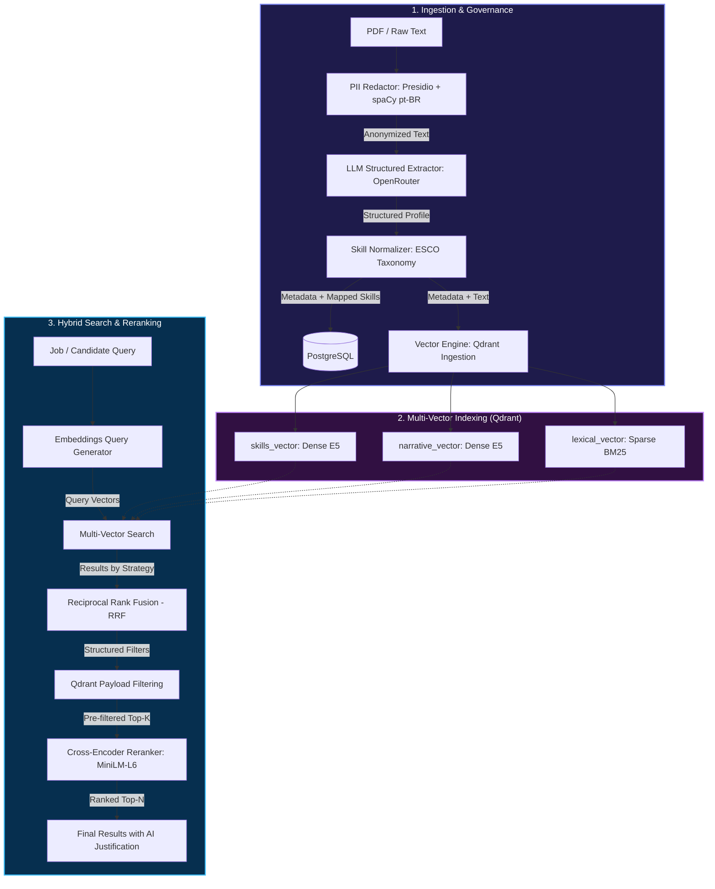

# Resume Ranker 🤖💼

<div align="center">


</div>

> AI-Powered Candidate-Job Matching Platform with Hybrid Semantic Search, Bias Governance, and End-to-End Explainability.

This is a professional, open-architecture portfolio project that addresses the limitations of traditional talent screening tools. Instead of relying solely on lexical search (rigid keywords) or pure semantic search (which can overlook hard requirements), the **Resume Ranker** combines the best of both worlds into a robust, auditable hybrid system.

---

## 🚀 Platform Highlights

1. **Hybrid Semantic & Lexical Search (Bidirectional)**:
   - **Dense Vector (Skills)**: Semantic mapping of normalized technical skills against the official European **ESCO** taxonomy.
   - **Dense Vector (Narrative)**: Cosine similarity over the free-form trajectory and described experiences.
   - **Sparse Vector (Lexical)**: Exact technical terms and certifications natively indexed in Qdrant.
   - **RRF (Reciprocal Rank Fusion)**: Mathematical fusion of the multiple rankings before refinement.
   - **Cross-Encoder Reranker**: Deep processing over the top-K of the final ranking using a lightweight local model.

2. **Evidence-Based Explainability Module**:
   - LLM-generated textual justification containing explicit match evidence.
   - **Hallucination Guardrail (Citation Validation)**: Automatic substring validation on the backend to certify that the citations produced by the model exist 100% verbatim in the original raw resume.

3. **Bias Governance & Audit Module (Fairness)**:
   - **PII Redactor**: Mandatory local anonymization (Microsoft Presidio + spaCy pt-BR) of data such as CPF, RG, phone numbers, names, and emails before any submission to external LLM APIs.
   - **Counterfactual Bias Audit**: Automated counterfactual test that clones the resume, performs gender swaps (he/she pronouns and masculine/feminine job-title forms) and common fictitious names, then measures the variation (delta) of the similarity score, which must be below 1% to pass.

4. **Quantitative Evaluation Harness**:
   - Quantitative Information Retrieval evaluation computing **NDCG@5**, **NDCG@10**, and **MRR** against a labeled ground truth (`qrels.json`) to determine the best empirical search weights.

---

## 📐 System Architecture

The **Resume Ranker** engine operates on three main integrated flows: governance-aware ingestion, multi-vector representation, and hybrid search refined by local AI.



---

## 🛠️ Tech Stack

### Backend (`/api`)
- **FastAPI**: Fast, self-documenting endpoints via Swagger/OpenAPI.
- **SQLAlchemy & SQLite/PostgreSQL**: Relational persistence for raw and anonymized profiles, extracted metadata, and audit logs.
- **Qdrant**: High-performance vector database for storing multiple named vectors (`skills_vector`, `narrative_vector`, and `lexical_vector`).
- **Sentence-Transformers**: Local execution of embedding (E5) and Cross-Encoder models.
- **Microsoft Presidio + spaCy**: Local PII recognition and sanitization.

### Frontend (`/web`)
- **Next.js 16 (App Router)** & **React 19**: Modern SPA architecture.
- **TailwindCSS v4**: Fluid, state-of-the-art styling.
- **Premium Design System (Glassmorphic Dark Mode)**: Translucent interface with blur effects, dynamic light gradients, and custom scrollbars.
- **TypeScript & openapi-typescript**: 100% safe typing generated directly from the backend documentation endpoint.
- **Lucide-React**: Modern collection of vector icons.

---

## 📁 Directory Structure

```text
resume_ranker/
├── api/                  # Backend code (FastAPI)
│   ├── data/             # Offline ESCO database
│   ├── eval/             # Seed and evaluation scripts (NDCG/MRR)
│   ├── tests/            # Unit and integration test suite
│   ├── main.py           # API route configuration and startup
│   ├── search.py         # Hybrid search engine on Qdrant + RRF + Reranker
│   ├── fairness.py       # Counterfactual bias audit and swaps
│   └── explain.py        # Explanation generation and citation guardrails
├── web/                  # Frontend code (Next.js)
│   ├── src/
│   │   ├── app/          # Pages and global styles (page.tsx, globals.css)
│   │   └── types/        # Auto-generated TypeScript types
│   └── package.json      # Next.js dependencies
└── docs/                 # Spec Driven Development (SDD) specifications
```

---

## 🔧 Running the Project Locally

### Step 1: Run the Backend (`/api`)

1. Navigate to the backend folder:
   ```bash
   cd api
   ```

2. Create and activate a Python virtual environment:
   ```bash
   python -m venv .venv
   # On Windows (PowerShell):
   .venv\Scripts\Activate.ps1
   # On Linux/Mac:
   source .venv/bin/activate
   ```

3. Install the required dependencies:
   ```bash
   pip install -r requirements.txt
   ```

4. Download the spaCy language model for Portuguese anonymization:
   ```bash
   python -m spacy download pt_core_news_lg
   ```

5. Create or configure your `.env` file (or use the built-in default variables):
   ```env
   OPENROUTER_API_KEY=your_key_here
   EMBEDDING_PROVIDER=local  # Options: local, voyage, openai
   ```
   *Note: The system has automatic local fallback (on-disk SQLite and persistent Qdrant storage in the `api/eval/qdrant_storage` folder), sparing you from complex Docker setup if you prefer to run it in isolation.*

6. Start the FastAPI server:
   ```bash
   uvicorn api.main:app --reload --port 8000
   ```

### Step 2: Run the Frontend (`/web`)

1. Open a separate terminal in the frontend folder:
   ```bash
   cd web
   ```

2. Install the npm packages:
   ```bash
   npm install
   ```

3. With the backend API running on port 8000, you can generate/update the static TypeScript types:
   ```bash
   npx openapi-typescript ../api/openapi.json -o src/types/api.ts
   ```

4. Start the development server:
   ```bash
   npm run dev
   ```
   Access the premium interface in your browser at: `http://localhost:3000`.

---

## 🧪 Test Suite & Validation

### Automated Backend Tests
The platform includes mathematical unit tests for the retrieval metrics, anonymization flow tests (PII Redactor), and integration tests simulating the complex vector search.

Run the suite with the virtual environment active from the root or the `/api` folder:
```bash
# Run from the /api folder
.venv\Scripts\python -m pytest
```

### Frontend Build & Lint
To ensure code quality and static correctness on the frontend:
```bash
# Run from the /web folder
npm run lint
npm run build
```

---

## 📊 Running the Weight Benchmarking (Information Retrieval)

You can simulate and evaluate the effectiveness of the hybrid search algorithm with different dense/sparse vector weight configurations by running the native evaluation script:
```bash
# Run from the /api folder with the venv active
python -m api.eval.run_harness
```
This script will compute and print in tabular format the **NDCG@5**, **NDCG@10**, and **MRR** gains under various vector weight compositions, ensuring empirical grounding for the choice of search parameterization.
