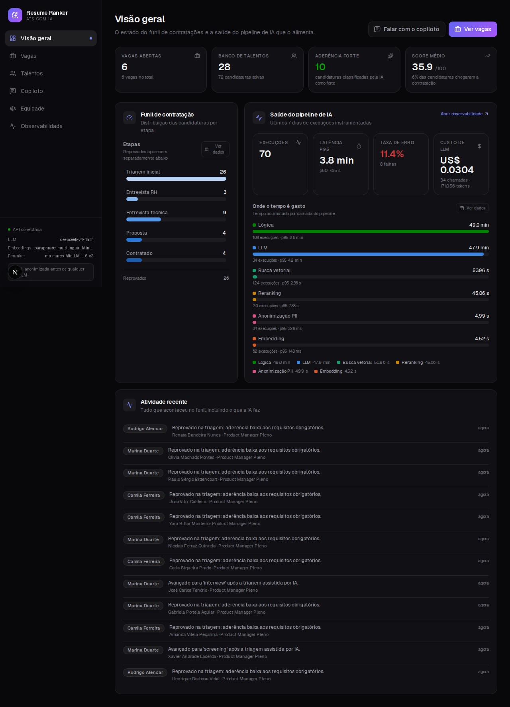
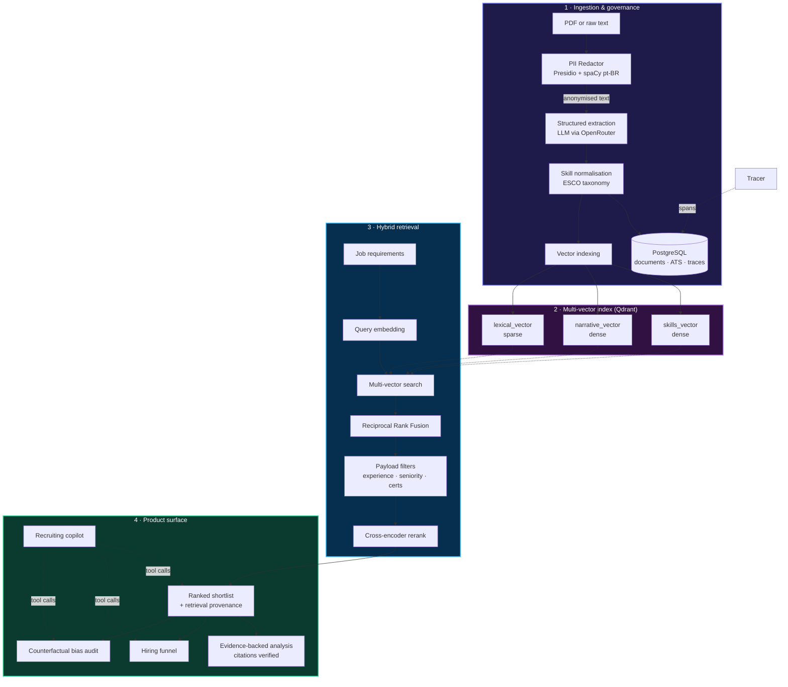
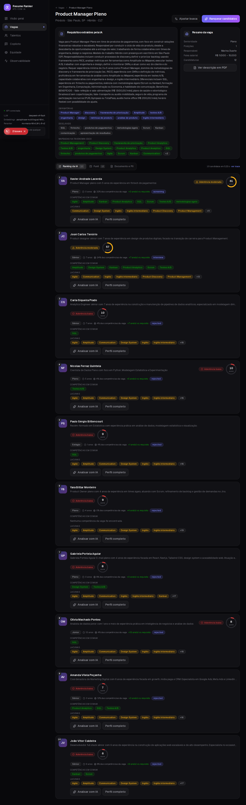
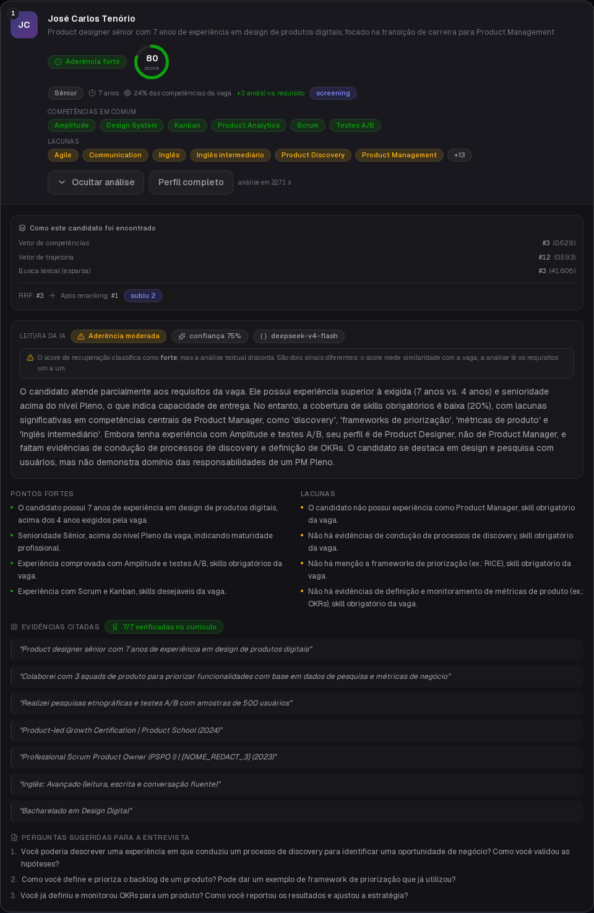
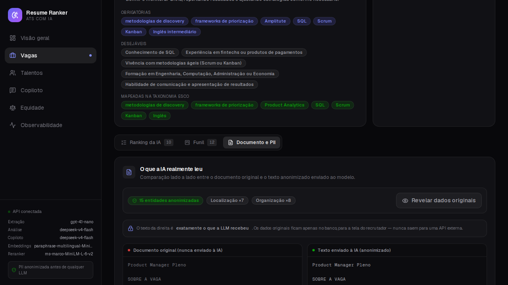
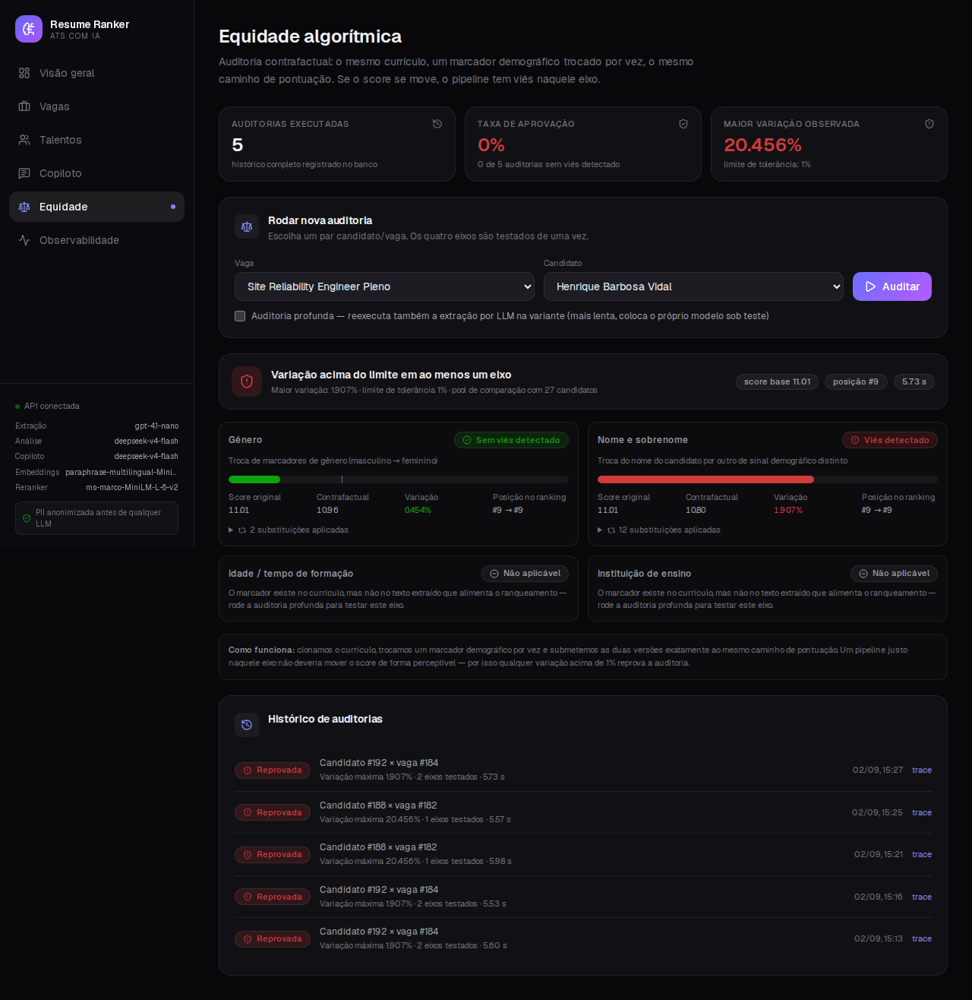
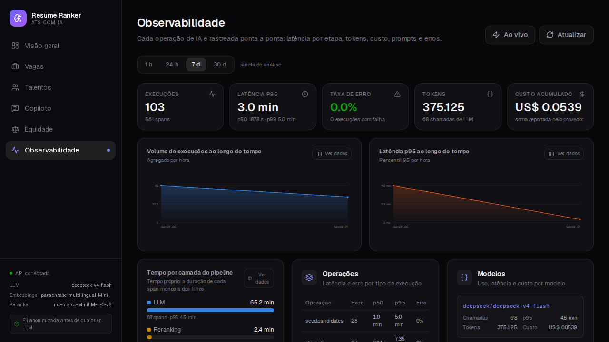
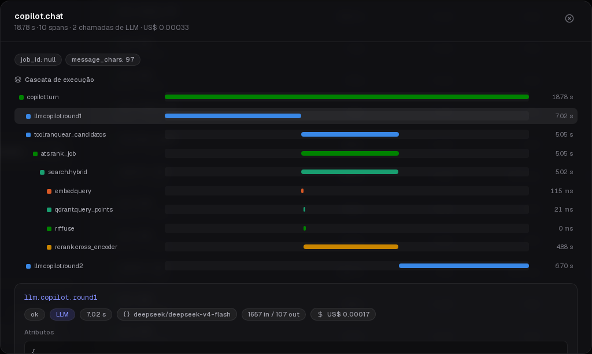
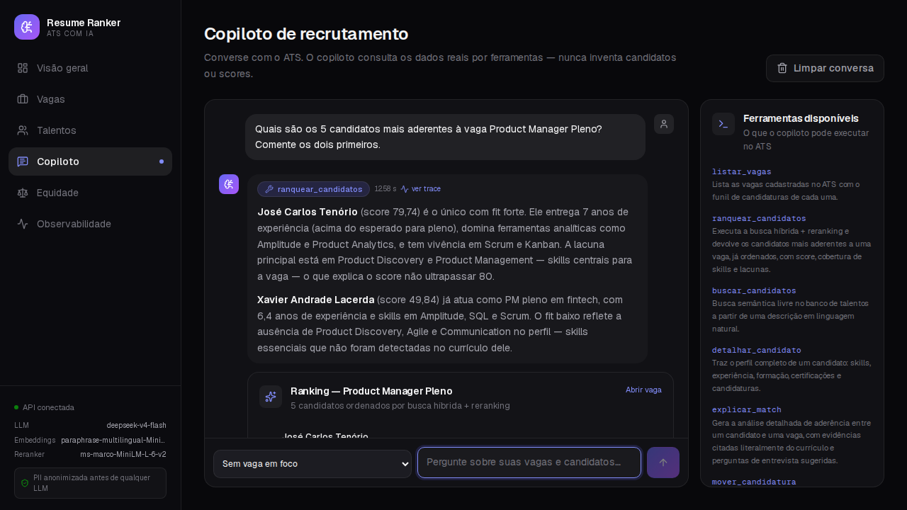

# Resume Ranker

<div align="center">

**An applicant tracking system where the AI ranking is explainable, auditable and fully traced.**


</div>

---

Most résumé screening tools give you a number and ask you to trust it. This one shows you the whole chain: which retrieval strategy surfaced a candidate, how the reranker moved them, which required skills they actually cover, which quotes in the AI's reasoning exist verbatim in their résumé — and how many milliseconds and cents each of those steps cost.

The product is a working ATS: publish a job, drop in résumés, get a ranked shortlist, move people through the funnel, and talk to a copilot that operates the whole thing in plain Portuguese. The interface is in **pt-BR**, because the anonymisation and taxonomy layers are tuned for Brazilian résumés (CPF, RG, DDD phone numbers, pt-BR skill synonyms).

<div align="center">



</div>

---

## Table of contents

- [What makes it different](#what-makes-it-different)
- [Architecture](#architecture)
- [How the ranking works](#how-the-ranking-works)
- [Retrieval evaluation](#retrieval-evaluation)
- [Explainability: the citation guardrail](#explainability-the-citation-guardrail)
- [Privacy: the PII boundary](#privacy-the-pii-boundary)
- [Fairness: counterfactual auditing](#fairness-counterfactual-auditing)
- [Observability](#observability)
- [The conversational copilot](#the-conversational-copilot)
- [Tech stack](#tech-stack)
- [Running it locally](#running-it-locally)
- [Project layout](#project-layout)
- [Tests](#tests)
- [Design decisions worth knowing](#design-decisions-worth-knowing)
- [Limitations](#limitations)

---

## What makes it different

**1. The score is calibrated, not invented.**
A cross-encoder emits an unbounded logit. Passing it through a sigmoid centred on zero is arbitrary — on Portuguese résumés it crushed every candidate into single digits. Instead, the decision boundary was *measured* against labelled data: raw `-2.93` separates relevant from irrelevant candidates with **95.2% accuracy**, so that value became the midpoint of the display scale. A score of 50 now means exactly one thing: the reranker considers this person relevant.

**2. Every quote is verified against the source.**
The LLM writes the analysis, but each citation it produces is checked verbatim (case-, accent- and whitespace-insensitive) against the candidate's own text. Unverified quotes are shown and flagged, not hidden — a hallucination you can see is a hallucination you can act on.

**3. Identity is recovered locally, never sent to a model.**
PII is stripped before the first external call. The recruiter still sees the real name, e-mail and phone, because those are restored from the redaction map on the way to the screen. The side-by-side viewer proves it: left is the original document, right is the exact text the model received.

**4. Bias is tested, not asserted.**
Four demographic axes — gender, name, age and university prestige — are each flipped in isolation and pushed through the same scoring path. The delta is measured and reported per axis.

**5. Everything is traced.**
Latency, tokens, cost, prompts, responses and errors, per pipeline layer, with a clickable execution waterfall.

---

## Architecture



---

## How the ranking works

Every profile is indexed under **three representations**, because each one fails differently:

| Vector | Content | Good at | Blind to |
|---|---|---|---|
| `skills_vector` | ESCO-normalised skill labels | Synonyms — `k8s` finds `Kubernetes` | Context and seniority |
| `narrative_vector` | Free-form career narrative | Trajectory and scope of work | Exact tool names |
| `lexical_vector` | Sparse bag of terms + certifications | Exact tokens — `CKA`, `C++`, `dbt` | Any paraphrase |

The three rankings are fused with **weighted Reciprocal Rank Fusion**:

$$\text{RRF}(d) = \sum_{m} \frac{w_m}{k + \text{rank}_m(d)}$$

with `k = 60` and 1-based ranks. The top-K then goes through a local **cross-encoder** that scores each `(job, candidate)` pair jointly instead of comparing pre-computed vectors.

The interface exposes all of it. Each result carries the rank it held in *each* strategy, its position after fusion, and its position after reranking — so "why is this person first?" has a mechanical answer, not a vibe.

<div align="center">



</div>

Hard requirements stay out of the vector space entirely: minimum years of experience, accepted seniority levels and mandatory certifications are **Qdrant payload filters** applied before scoring. Semantic similarity should never talk someone into a role that requires a certification they don't hold.

---

## Retrieval evaluation

The demo corpus doubles as a labelled evaluation set: each synthetic résumé was written to be a strong / moderate / poor fit for one specific job, which maps to graded relevance 3 / 2 / 0. That gives 6 queries over 28 candidates — 168 judgements.

```bash
make eval
```

<!-- EVAL_TABLE -->

| Configuration | Weights | Rerank | NDCG@5 | NDCG@10 | MRR |
|---|---|:---:|---:|---:|---:|
| Skills vector only (dense) | `1, 0, 0` | no | **0.8849** | 0.8978 | 1.0000 |
| Narrative vector only (dense) | `0, 1, 0` | no | 0.5456 | 0.6665 | 0.8333 |
| Lexical vector only (sparse) | `0, 0, 1` | no | 0.8586 | 0.8757 | 0.9167 |
| RRF, equal weights, no rerank | `1, 1, 1` | no | 0.8731 | 0.9009 | 1.0000 |
| RRF, default weights, no rerank | `1, 1, 0.5` | no | 0.8765 | 0.9180 | 1.0000 |
| **RRF, default weights + cross-encoder** ← shipped | `1, 1, 0.5` | yes | 0.8768 | **0.9202** | 1.0000 |
| RRF, skills-heavy + cross-encoder | `1.5, 1, 0.5` | yes | 0.8768 | 0.9202 | 1.0000 |
| RRF, narrative-heavy + cross-encoder | `1, 1.5, 0.5` | yes | 0.8768 | 0.9202 | 1.0000 |

<sub>6 queries · 28 candidates · 168 graded judgements · reranker <code>cross-encoder/ms-marco-MiniLM-L-6-v2</code>. Best value per column in bold. Regenerate with <code>make eval</code>.</sub>

Four things this table says, including the inconvenient ones:

- **The narrative vector is the weak one** (NDCG@5 0.55). Career prose is where seniority and scope live, but on its own it confuses a data engineer with an ML engineer. It earns its place in the fusion, not on its own.
- **The skills vector alone edges out the full pipeline at NDCG@5** — 0.8849 against 0.8768. With six queries that gap is inside the noise, but it is real and worth reporting rather than hiding. The hybrid wins where it matters more for a shortlist that runs past the podium: **NDCG@10 0.9202 vs 0.8978**.
- **The cross-encoder barely moves the ranking here** (0.9180 → 0.9202 at @10). Its real contribution in this system is not the ordering, it is producing a *joint* score that can be calibrated into a number a recruiter can read. On a corpus this clean, RRF has already done most of the work.
- **A multilingual reranker was tried and rejected.** `mmarco-mMiniLMv2-L12-H384` produced a much nicer-looking score distribution on Portuguese text — and *worse* ranking quality (NDCG@5 0.53 against 0.88 on an earlier run of this same harness). The English model stayed, and the ugly score scale was fixed by calibration instead of by swapping models. The measurement overruled the intuition.

Weight variations above the default make no difference on this corpus, which is itself informative: the fusion is not sensitive to tuning at this scale, so the default stays at `1, 1, 0.5`.

The calibration itself is reproducible:

```bash
make calibrate
```

---

## Explainability: the citation guardrail

The analysis has two layers, deliberately separated.

**Deterministic** — skill overlap, must-have coverage, experience delta and seniority distance are computed in Python from the ESCO-normalised profiles. These numbers never come from a model, and they are fed *into* the prompt as ground truth the model is told not to contradict.

**Generative** — the LLM writes the narrative, the strengths, the gaps and suggested interview questions. Then every direct quote it produced is checked against the candidate's own text. The UI reports the ratio, and unverified quotes are marked in red rather than dropped.

<div align="center">



</div>

If the LLM is unavailable or returns something unusable, the endpoint degrades to a deterministic summary built from the same signals and says so — it never fabricates a fallback that looks like a real analysis.

---

## Privacy: the PII boundary

Anonymisation runs **before** the first external call, using Microsoft Presidio with a spaCy pt-BR model plus custom recognisers for Brazilian identifiers:

- **CPF** with check-digit validation (an invalid CPF is not redacted as one — it's a false positive)
- **RG**, in masked and unmasked forms
- **Brazilian phone numbers**, across the formats people actually type
- Names, e-mails, IPs, locations and organisations via NER, filtered through a whitelist so section headings and technology names don't get destroyed

<div align="center">



</div>

The recruiter-facing name is recovered from the résumé's opening lines or the redaction map, validated against a name pattern *and* against the ESCO taxonomy — because spaCy will happily tag `Kimball`, `Logstash` and `DAGs` as people. Anything the taxonomy recognises as a competency is rejected as a name.

Text the model writes comes back peppered with tokens like `[ORGANIZACAO_REDACT_1]`. Those are rehydrated at the display boundary, so the recruiter reads real company names in a summary the model wrote without ever seeing them.

---

## Fairness: counterfactual auditing

Clone the résumé, flip one demographic marker, run both versions through the *same* scoring path, measure the movement. A pipeline that is fair on a given axis should barely move.

| Axis | What gets swapped |
|---|---|
| `genero` | Pronouns and gendered job titles |
| `nome` | Given names and surnames, varying the demographic signal |
| `idade` | Graduation years and tenure phrasing |
| `instituicao` | Elite universities → lesser-known institutions |

<div align="center">



</div>

Two details that matter:

- Scoring happens **in process**, against a live pool of real candidates. The original audit wrote temporary IDs into the production collection, which polluted concurrent searches; it now touches nothing.
- The delta is computed on the **calibrated 0–100 scale**, not on raw logits. Cross-encoder scores are signed, so a percentage over a negative number is meaningless — the original implementation passed every audit involving a negative score for exactly that reason.

`--deep` additionally re-runs the LLM extraction on the counterfactual, putting the extraction step itself under audit.

---

## Observability

Every meaningful unit of work runs inside a **span**, and spans nest automatically through a `contextvars` stack, so the recorded tree mirrors the real call graph. Spans carry a `kind` — `llm`, `embedding`, `vector`, `rerank`, `pii`, `parse`, `tool`, `logic` — which is what lets the dashboard break latency down by layer.

<div align="center">



</div>

Per LLM span: model, prompt and completion tokens, USD cost (taken from the provider's own `usage.cost`, with a local price table as fallback), truncated prompt and response, finish reason and retry count.

Clicking a trace opens the execution waterfall, where each span is positioned by its real offset from the start of the operation. Clicking a span shows exactly what went in and what came out.

<div align="center">



</div>

The guarantees are the boring but important ones: an exception marks the span *and* the trace and is re-raised; the trace is flushed even when the request blows up; and a failure to persist telemetry is logged and swallowed, because instrumentation must never take down a request.

---

## The conversational copilot

The copilot has no access to the database. It has a catalogue of eight tools, executed in Python with the recruiter's own session, and a context preamble listing job IDs and titles. Every concrete fact in its answer came back from a tool call.

<div align="center">



</div>

Each tool returns two things: a compact digest that goes back to the model, and a **card** the frontend renders. Ask for a ranking and you get two sentences of commentary plus the actual ranked list as UI — not a table transcribed into prose.

| Tool | Action |
|---|---|
| `listar_vagas` | List jobs with their funnels |
| `ranquear_candidatos` | Run hybrid search + reranking for a job |
| `buscar_candidatos` | Free-text semantic search of the talent pool |
| `detalhar_candidato` | Full candidate profile |
| `explicar_match` | Evidence-backed analysis of one pair |
| `mover_candidatura` | Move an application through the funnel |
| `resumo_pipeline` | Aggregate ATS numbers |
| `auditar_vies` | Counterfactual bias audit |

The whole turn is one trace: each model round-trip is an `llm` span, each tool execution is a `tool` span with its input and output. The UI shows which tools ran and links straight to the waterfall.

---

## Tech stack

**Backend** — FastAPI, SQLAlchemy 2, PostgreSQL, Qdrant, sentence-transformers (E5-family multilingual embeddings + MS MARCO cross-encoder, both local), Microsoft Presidio + spaCy `pt_core_news_lg`, PyMuPDF, RapidFuzz, OpenRouter for the LLM.

**Frontend** — Next.js 16 (App Router), React 19, TypeScript, Tailwind CSS v4, lucide-react. Charts are hand-rolled SVG — no charting dependency — with a categorical palette validated for colour-vision deficiency against the app's dark surface, table views on every chart, and status meaning never carried by colour alone.

**Testing** — pytest for the backend (fully offline: the LLM, embeddings and Qdrant are replaced by deterministic doubles), Playwright for end-to-end journeys against a live stack.

---

## Running it locally

**Prerequisites:** Docker, Python 3.11+, Node 20+, and an [OpenRouter API key](https://openrouter.ai/keys).

```bash
# 1 · Infrastructure (PostgreSQL + Qdrant)
make up

# 2 · Configuration
cp api/.env.example api/.env
$EDITOR api/.env          # set OPENROUTER_API_KEY

# 3 · Dependencies (backend venv, spaCy model, frontend packages)
make install

# 4 · Populate the ATS with the demo corpus
make seed                 # ~15 min: 34 documents through the full pipeline

# 5 · Run it
make dev-api              # http://localhost:8000  (docs at /docs)
make dev-web              # http://localhost:3100
```

The demo corpus (28 résumés, 6 job descriptions, all synthetic) is committed under `api/data/seed/`, so seeding is reproducible without regenerating it. To regenerate from scratch:

```bash
make corpus                                          # generate with an LLM
python -m api.eval.normalize_seed_corpus             # distinct, valid identities
```

Embeddings and reranking run **locally** by default — the only paid API call is the LLM, and with `deepseek/deepseek-v4-flash` a full seed costs a few cents.

---

## Project layout

```
resume_ranker/
├── api/
│   ├── observability.py      # tracer: nested spans, latency, tokens, cost, errors
│   ├── telemetry.py          # trace persistence and metric roll-ups
│   ├── llm.py                # single LLM entry point: retries, schema repair, cost
│   ├── redactor.py           # PII removal with Brazilian recognisers
│   ├── extractor.py          # structured extraction from anonymised text
│   ├── normalizer.py         # ESCO taxonomy matching (exact → fuzzy → embedding)
│   ├── search.py             # multi-vector retrieval, RRF, reranking, calibration
│   ├── explain.py            # deterministic signals + verified citations
│   ├── fairness.py           # counterfactual auditing across four axes
│   ├── ats.py                # ATS domain: ingestion, ranking, funnel, identity
│   ├── copilot.py            # tool-calling agent over the ATS
│   ├── routers/              # HTTP surface
│   ├── eval/                 # corpus generation, seeding, IR harness, calibration
│   ├── data/seed/            # the committed demo corpus
│   └── tests/                # 201 backend tests
├── web/
│   ├── src/app/              # dashboard, jobs, candidates, copilot, fairness, observability
│   ├── src/components/       # UI primitives, charts, ATS widgets, copilot cards
│   ├── src/lib/              # typed API client and hooks
│   └── e2e/                  # Playwright journeys and screenshot capture
└── docs/specs/               # spec-driven development cards, milestones 1–7
```

---

## Tests

```bash
make test          # backend suite — offline, no API keys required
make lint          # frontend eslint + tsc
make build         # frontend production build

cd web && npx playwright test          # end-to-end, needs a live seeded stack
cd web && npx playwright test e2e/screenshots.spec.ts   # regenerate the images above
```

The backend suite covers RRF arithmetic, score calibration, filter construction, indexing, the hybrid pipeline, ESCO matching, the citation guardrail, deterministic match signals, all four bias axes, identity recovery, funnel transitions, the ranking snapshot, the copilot's tool loop, span nesting and error capture, metric aggregation, and the LLM client's retry and schema-repair paths.

---

## Design decisions worth knowing

**Why 1-based ranks in RRF.** The original implementation used the 0-based loop index, which gives the top hit of each strategy `w/k` instead of `w/(k+1)` — systematically overweighting first place. Fixed, with a test that pins the exact value.

**Why the reranker isn't multilingual.** See [Retrieval evaluation](#retrieval-evaluation). The measurement disagreed with the intuition and the measurement won.

**Why identity lives outside the AI path.** Keeping the name in a separate table isn't a workaround for anonymisation — it *is* the design. The pipeline reads only from the redacted text; the ATS reads only from its own columns. The guarantee is structural, and there is a test that asserts the raw text never reaches the extractor.

**Why charts are hand-rolled.** A charting library would have been faster, but the constraints here (validated CVD-safe palette against a specific dark surface, table view on every chart, status never carried by colour alone, a Gantt-style span waterfall) are easier to satisfy directly than to configure around.

**Why singletons.** `get_embedding_provider()` used to construct a fresh `SentenceTransformer` on every request — seconds of model loading per call. Both it and the Qdrant client are now process-wide.

---

## Limitations

- **The evaluation corpus is synthetic.** 168 judgements across 6 queries is enough to compare configurations and calibrate the score scale; it is not enough to claim production-grade retrieval quality. Real résumés are messier.
- **The bias audit tests the pipeline, not the world.** It proves the scoring path is insensitive to the markers it flips. It cannot detect bias encoded in the underlying embedding model, or in which résumés reach the system in the first place.
- **Citation verification catches fabricated quotes, not fabricated reasoning.** A model can build a wrong argument entirely out of real quotes.
- **Single-tenant, no authentication.** This is a portfolio project, not a multi-tenant SaaS. There is no auth, no role model and no data isolation.
- **`ms-marco-MiniLM` is an English model** doing well on Portuguese résumés largely because technical vocabulary is English. Expect degradation on non-technical roles written entirely in Portuguese.

---

<div align="center">

Built by [Lucca Pinto](https://github.com/luccapinto)

</div>
